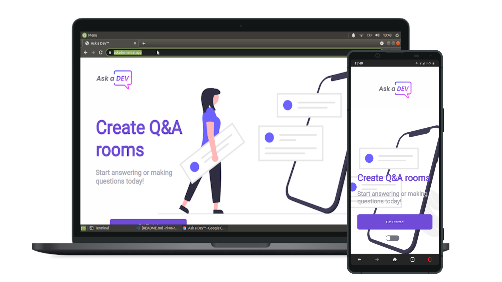

<h1 align="center">
    
</h1>

# Ask a dev: An web app to make and answer questions in no-time;

<h1 align="center">
    
</h1>

## Tools used in the project

### [VisualStudio Code](https://code.visualstudio.com)&trade;.

### [Zsh Shell](https://github.com/ohmyzsh/ohmyzsh/wiki/Installing-ZSH)&trade;.

### [Figma](https://figma.com/)&trade;.

### [Google Chrome](https://www.google.com/chrome/)&trade;.

### [Opera Developer](https://snapcraft.io/opera-developer)&trade;.

### [GIMP](https://gimp.org)&trade;.

### [Yarn](https://yarnpkg.com/)&trade;.

## Techs embed

### [Typescript](https://www.typescriptlang.org)&trade;.

### [ReactJS](https://reactjs.org)&trade;.

### [React Router Dom](https://rectrouter.com)&trade;.

### [Material UI](https://material-ui.com)&trade;.

### [CSS](https://www.w3schools.com/css/)&trade;.

### [Firebase](https://www.firebase.com)&trade;.

## How to run in your environment

This project was bootstrapped with [Create React App](https://github.com/facebook/create-react-app).

### First things, first

### Clone this repo to your machine, then
install all dependencies with the command ` yarn ` in any terminal.

### Create app in firebase and configure ` realtime database ` and ` firebase auth `.

### Then, create, in the root of the project a file called ` .env.local ` and puts all firebase config variables there, they're not shipped in this repo.

## Available Scripts

### In the project directory, you can run:

### `yarn dev`

### Runs the app in the development mode.\
Open [http://localhost:3000](http://localhost:3000) to view it in the browser.

The page will reload if you make edits.\
You will also see any lint errors in the console.

## Learn More

You can learn more in the [Create React App documentation](https://facebook.github.io/create-react-app/docs/getting-started).

To learn React, check out the [React documentation](https://reactjs.org/).

## A preview of the app can be found at
> ### [AskADev](https://askadev.vercel.app)&trade;.

## Conhe&ccedil;a a [Vercel]()&trade;.
